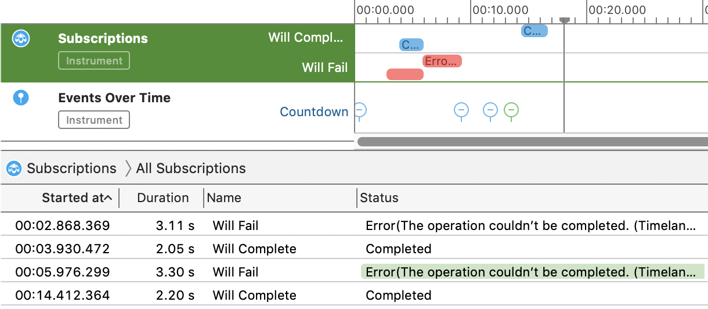

<h1 align="center"> Timelane + Combine </h1>
<p align="center"> 
   
</p>

**TimelaneCombine** provides a Combine bindings for profiling Combine code with the Timelane Instrument.



<p align="center">
    
    
    
</p>

#### Table of Contens:

- [Usage](#Usage)
- [Reference](#Reference)
- [Installation](#Installation)
- [Demo](#Demo)
- [License](#License)

# Usage

Import the TimelaneCombine framework in your code:

```swift
import TimelaneCombine
```

Use the `lane(_)` operator to profile a subscription via the TimelaneInstrument. Insert `lane(_)` at the precise spot in your code you'd like to profile like so:

```swift
downloadImage(at: url).
  .lane("Download: \(url.path)")
  .assign(to: \.image, on: myImageView)
```

Then profile your project by clicking **Product > Profile** in Xcode's main menu.

Select the Timelane Instrument template:


Inspect your subscriptions on the timeline:


For a more detailed walkthrough go to [http://timelane.tools](http://timelane.tools).

# Reference

## `lane(_:filter:)`

Use `lane("Lane name")` to send data to both the subscriptions and events lanes in the Timelane Instrument.

`lane("Lane name", filter: [.subscriptions])` sends begin/completion events to the Subscriptions lane. Use this syntax if you only want to observe concurrent subscriptions.

`lane("Lane name", filter: [.events])` sends events and values to the Events lane. Use this filter if you are only interested in values a subscription would emit (e.g. for example subjects).

Additionally you can transform the values logged in Timelane by using the optional `transformValue` trailing closure:

```swift
lane("Lane name") { value in
  return "Value: \(value)"
}
```

In case you are using `@Published` you can easily log that subscription to Timelane by using replacing it with:

```
@PublishedOnLane("My Lane") var property: String
```

# Installation

## Swift Package Manager

I . Automatically in Xcode:

 - Click **File > Swift Packages > Add Package Dependency...**  
 - Use the package URL `https://github.com/icanzilb/TimelaneCombine` to add TimelaneCombine to your project.

II . Manually in your **Package.swift** file add:

```swift
.package(url: "https://github.com/icanzilb/TimelaneCombine", from: "1.0.4")
```

## CocoaPods

[CocoaPods](https://cocoapods.org) is a dependency manager for Cocoa projects. For usage and installation instructions, visit their website. To integrate TimelaneCombine into your Xcode project using CocoaPods, specify it in your `Podfile`:

```ruby
pod 'TimelaneCombine', '~> 1.0.4'
```

### Carthage

[Carthage](https://github.com/Carthage/Carthage) is a decentralized dependency manager that builds your dependencies and provides you with binary frameworks. To integrate TimelaneCombine into your Xcode project using Carthage, specify it in your `Cartfile`:

```ogdl
github "icanzilb/TimelaneCombine" "1.0.4"
```

# Demo

The Timelane package contains a demo app at: https://github.com/icanzilb/timelane.

# License

Copyright (c) Marin Todorov 2020
This package is provided under the MIT License.
